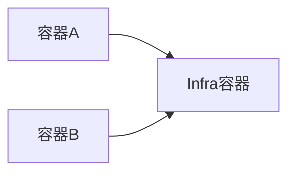

##**知识点**
- 容器的本质：Namespace做隔离，Cgroups做限制，rootfs做文件系统。
- 容器的本质是进程，kubernetes就是操作系统，容器的镜像是系统里的.exe安装包。
- Pod是kubernetes中最小的API对象，是原子调度单位。
- Pod只是一个逻辑概念，kubernetes真正处理的还是宿主机操作系统上Linux容器的Namespace和Cgroups。
- Pod是一组共享了某些资源的容器。
- Pod扮演的是虚拟机的角色，容器扮演的是这个虚拟机运行的用户程序。

##**Infra容器**

Pod的实现需要使用一个中间容器Infra，Infra容器在Pod中第一个被创建，其他容器通过Join Network Namespace方式与Infra关联在一起。



这意味着，对于Pod里的容器A和容器B来说：

- 它们可以直接使用localhost进行通信
- 它们看到的网络设备和Infra容器看到的完全一样
- 一个Pod只有一个IP地址，也就是这个Pod的Network Namespace对应的IP地址
- 其他所有的网络资源都是一个Pod一份，并且被该Pod中所有容器共享
- Pod的生命周期只跟Infra容器一致，而与容器A和容器B无关

有了这种设计之后，共享Volume就简单多了：Kubernetes项目只要把所有Volume的定义都涉及在Pod层级即可。这样，一个Volume对应的宿主机目录对于Pod来说就只有一个，Pod里的容器只要声明挂载这个Volume，就可以共享这个Volume对应的宿主机目录，示例如下：

```yaml
apiVersion: v1
kind: Pod
metadata:
  name: two-containers
spec:
  restartPolicy: Never
  volumes:
  - name: shared-data
    hostPath:
      path: /data
  containers:
  - name: nginx-container
    image: nginx
    volumeMounts:
    - name: shared-data
      mountPath: /usr/share/nginx/html
  - name: debian-container
    image: debian
    volumeMounts:
    - name: shared-data
      mountPath: /pod-data
    command: ["/bin/sh"]
    args: ["-c", "echo Hello from the debian container > /pod-data/index.html"]  
```

在这个示例中，debian-container和nginx-container都声明挂载了shared-data这个Volume。而shared-data是**hostPath类型**，所以他在宿主机上对应目录就是/data，这个目录被同时绑定挂载进了上述两个容器中。

从而nginx-container可以在它的/usr/share/nginx/html目录中读取到debian-container生成的index.html文件。

##实践
###**War包与Web服务器**

有一个Java Web应用的WAR包，它需要放在Tomcat的webapps目录下运行：

```yaml
apiVersion: v1
kind: Pod
metadata:
  name: javaweb-2
spec:
  initContainers:
  - image: geektime/sample:v2
    name: war
    command: ["cp", "/sample.war", "/app"]
    volumeMounts:
    - mountPath: /app
      name: app-volume
  containers:
  - image: geektime/tomcat:7.0
    name: tomcat
    command: ["sh", "-c", "/root/apache-tomcat-7.0.42-v2/bin/start.sh"]
    volumeMounts:
    - mountPath: /root/apache-tomcat-7.0.42-v2/webapps
      name: app-volume
    ports:
    - containerPort: 8080
      hostPort: 8001
  volumes:
  - name: app-volume
    emptyDir: {}
```

第一个容器是**InitContainer类型**的容器，这种容器会比sepc.containers定义的用户容器先启动。并且，InitContainer容器会按顺序逐一启动，知道它们都启动并退出了，用户容器才会启动。

InitContainer类型的WAR包容器先启动之后，执行了一句`cp /sample.war /app`，把应用的WAR包复制到了/app目录下，然后退出。这个/app目录挂载了一个名为app-volume的Volume。

而Tomcat容器同样声明挂载了app-volume到自己的webapps目录下。所以，Tomcat容器启动时，它的webapps目录下一定会有sample.war文件：这个文件正是WAR包容器启动时复制到这个Volume中的，而这个Volume被两个容器共享。

这种组合操作，是容器设计模式中最常用的一种形式：**sidecar**，指的是可以在一个Pod中启动一个辅助容器，来完成一些独立于主进程（主容器）的工作。

由于Pod的所有容器都共享同一个Network Namespace，因此很多与Pod网络相关的配置和管理都可以交给sidecar完成，完全无需干涉用户容器。
