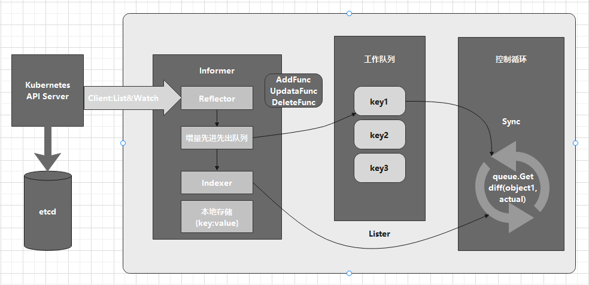

## **知识点**
- pass

## **为Network编写一个自定义控制器**
声明式API的业务功能实现需要通过控制器模式来监视API对象的变化，然后据此决定实际要执行的工作。

编写自定义控制器代码的过程包括三个部分：编写main函数，编写自定义控制器的定义，编写控制器的业务逻辑。

### **编写main函数**
main函数的主要作用是定义并初始化一个自定义控制器并启动它：
```go
func main() {
    ...
    cfg, err := clientcmd.BuildConfigFromFlags(masterURL, kubeconfig)
    ...
    kubeClient, err := kubernetes.NewForConfig(cfg)
    ...
    networkClient, err := clientset.NewForConfig(cfg)
    ...

    networkInformerFactory := informers.NewSharedInformerFactory(networkClient, time.Second*30)

    controller := NewController(kubeClient, networkClient,
    networkInformerFactory.Samplecrd().V1().Networks())

    go networkInformerFactory.Start(stopCh)

    if err = controller.Run(2, stopCh); err != nil {
        glog.Fatalf("Error running controller: %s", err.Error())
    }
}
```
这个main函数主要通过三步完成初始化并启动一个自定义控制器的工作：
1. main函数根据提供的Master配置（API Server的地址端口和kubeconfig的路径），创建一个Kubernetes的client（kubeClient）和Network对象的client（networkClient）。
   如果没有提供Master配置，main函数会使用一种InClusterConfig的方式创建client。该方式会假设自定义控制器以Pod的方式在Kubernetes集群中运行。
   Kubernetes中所有Pod会以Volume方式自动挂载默认的ServiceAccount。所以，这个控制器直接使用默认ServiceAccount里的授权信息来访问API Server。
2. main函数为Network对象创建一个InformerFactory，并使用它生成一个Network对象的Informer，传递给控制器。
3. main函数启动上述Informer，然后执行controller.Run，启动自定义控制器。

自定义控制器的工作原理如下图所示：


- 控制器首先从API Server获取它关心的对象，也就是Network对象。这个操作是依靠`Informer`完成的。Informer与API对象一一对应，因此传递给自定义控制器的是一个Network对象的Informer（`Network Informer`）。
- 创建Informer工厂时，传递了`networkClient`。Network Informer正是使用networkClient跟API对象建立了连接。真正维护这个连接的时Informer的`Reflector`包。Reflector包使用`ListAndWatch`方法，获取并监听这些Network对象的变化。
- `ListAndWatch`机制下，一旦API Server端有新的Network实例被创建、删除或更新，Reflector会收到事件通知。这时，该事件及其对应的API对象这个组合，称为`增量`,会被放进`增量先进先出队列`。
- `Informer`会不断从`增量先进先出队列`读取（Pop）增量。每拿到一个增量，会判断这个增量里的事件类型，然后创建或更新本地对象的缓存，缓存一般称为`Store`，它就是**期望状态**。
- 如果事件类型是`Added`，`Informer`会通过`Indexer`把增量里API对象保存在缓存中，并创建索引。如果事件类型是`Deleted`，则会在本地缓存中删除这个对象。**同步缓存的工作是Informer的首要职责**。
- Informer的第二个职责就是根据这些事件的类型触发事先注册好的`ResourceEventHandler`。这些Handler需要在创建控制器时注册给它对应的Informer。
- 每经过`resyncPeriod`事件，Informer维护的本地缓存都会使用最近一次List返回的结果强制更新一次，这个操作称为`resync`。

### **编写控制器的定义**
```go
func NewController(
	kubeclientset kubernetes.Interface,
	networkclientset clientset.Interface,
	networkInformer informers.NetworkInformer) *Controller {

	...
	controller := &Controller{
		kubeclientset:    kubeclientset,
		networkclientset: networkclientset,
		networksLister:   networkInformer.Lister(),
		networksSynced:   networkInformer.Informer().HasSynced,
		workqueue:        workqueue.NewNamedRateLimitingQueue(workqueue.DefaultControllerRateLimiter(), "Networks"),
		recorder:         recorder,
	}

	...
	networkInformer.Informer().AddEventHandler(cache.ResourceEventHandlerFuncs{
		AddFunc: controller.enqueueNetwork,
		UpdateFunc: func(old, new interface{}) {
			oldNetwork := old.(*samplecrdv1.Network)
			newNetwork := new.(*samplecrdv1.Network)
			if oldNetwork.ResourceVersion == newNetwork.ResourceVersion {
				return
			}
			controller.enqueueNetwork(new)
		},
		DeleteFunc: controller.enqueueNetworkForDelete,
	})

	return controller
}
```
- 使用main函数中创建的kubeclientset和networkclientset以及Network Informer初始化自定义控制器。
- 自定义控制器内设置了一个工作队列`workqueue`，用于同步Informer和控制器循环之间的数据。
- 为network Informer注册了添加、更新和删除三个`Handler`，具体的处理操作都是将事件对应的API对象的key`<namespace>/<name>`加入工作队列。

控制循环部分时在main函数最后调用`controller.Run`启动的：
```go
func (c *Controller) Run(threadiness int, stopCh <-chan struct{}) error {
    ...
	if ok := cache.WaitForCacheSync(stopCh, c.networksSynced); !ok {
		return fmt.Errorf("failed to wait for caches to sync")
	}

    ...
	for i := 0; i < threadiness; i++ {
		go wait.Until(c.runWorker, time.Second, stopCh)
	}

    ...
	return nil
}
```
启动控制循环的逻辑如下：
1. 等待Informer完成一次本地缓存的数据同步操作。
2. 通过Goroutine启动一个（或并发启动多个）无限循环的任务。

### **编写控制器业务逻辑**
```go
func (c *Controller) runWorker() {
	for c.processNextWorkItem() {
	}
}

// processNextWorkItem will read a single work item off the workqueue and
// attempt to process it, by calling the syncHandler.
func (c *Controller) processNextWorkItem() bool {
	obj, shutdown := c.workqueue.Get()

    ...
	err := func(obj interface{}) error {
        ...
		if err := c.syncHandler(key); err != nil {
			return fmt.Errorf("error syncing '%s': %s", key, err.Error())
		}
		c.workqueue.Forget(obj)
		...
		return nil
	}(obj)

    ...
	return true
}

func (c *Controller) syncHandler(key string) error {

	namespace, name, err := cache.SplitMetaNamespaceKey(key)

    ...
	network, err := c.networksLister.Networks(namespace).Get(name)
	if err != nil {
		if errors.IsNotFound(err) {
			glog.Warningf("Network: %s/%s does not exist in local cache, will delete it from Neutron ...",
				namespace, name)

			glog.Infof("[Neutron] Deleting network: %s/%s ...", namespace, name)

			// FIX ME: call Neutron API to delete this network by name.
			//
			// neutron.Delete(namespace, name)

			return nil
		}

        ...
		return err
	}

	glog.Infof("[Neutron] Try to process network: %#v ...", network)

	// FIX ME: Do diff().
	//
	// actualNetwork, exists := neutron.Get(namespace, name)
	//
	// if !exists {
	// 	neutron.Create(namespace, name)
	// } else if !reflect.DeepEqual(actualNetwork, network) {
	// 	neutron.Update(namespace, name)
	// }


	return nil
}
```

- 在这个执行周期（`processNextWorkItem`）内，首先从工作队列里出队（`workqueue.Get`）一个成员，即一个Key（`Network对象的namespace/name`）。
- 在`syncHandler`方法中，尝试使用`networksLister`来获取这个Key对应的Network对象。该操作其实就是在访问本地缓存的索引。
- 如果控制循环从缓存中取不到这个对象，就意味着这个Key时通过删除事件加入工作队列的。需要调用Neutron的API来删除对应的Neutron网络。
- 如果能够获取到这个对象，就相当于获取到了期望状态，这时候需要通过Neutron来查询Network对象对应的真实网络是否存在。
  - 如果不存在，就需要使用Network对象信息调用Neutron API创建这个网络。
  - 如果存在，则需要比较两者是否一致，来判断是否需要通过Neutron API更新这个网络。