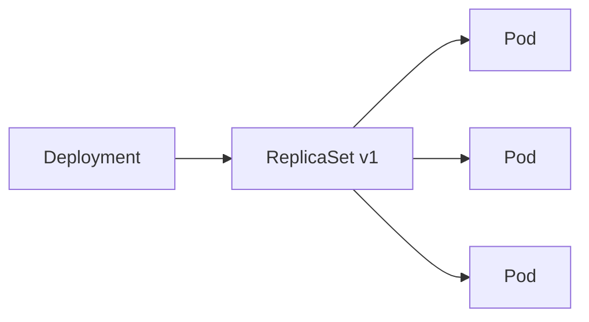

##**知识点**
- Deployment实际上是一个两层控制器：它通过ReplicaSet的个数来描述应用的版本，通过ReplicaSet的属性（比如repicas的值）来保证Pod的副本数量。
- Deployment控制ReplicaSet（版本），ReplicaSet控制Pod（副本数）。
- Deployment所管理的Pod的ownerReference是ReplicaSet。

##**ReplicaSet**
###**滚动更新**
如果更新了Deployment的Pod模板，那么Deployment就要遵循一种滚动更新的方式来升级现有容器。而这个能力的实现需要依赖ReplicaSet。
```yaml
apiVersion: apps/v1
kind: ReplicaSet
metadata:
  name: nginx-set
  labels:
    app: nginx
spec:
  replicas: 3
  selector:
    matchLabels:
      app: nginx
  template:
    metadata:
      labels:
        app: nginx
    spec:
      containers:
      - name: nginx
        image: nginx:1.7.9
        ports:
        - containerPort: 80
```
一个ReplicaSet对象是由副本数目的定义和一个Pod模板组成。它的定义其实是一个Deployment子集。Deployment控制器实际操纵的是这样的ReplicaSet对象而不是Pod。

一个定义了replicas=3的Deployment，与它的ReplicaSet以及Pod之间的关系如下所示：

Deployment只允许容器的restartPolicy=Always，因为只有在容器保证自己始终处于Running状态的前提下，ReplicaSet调整Pod的个数才有意义。

创建以上Deployment后查看：
```
$ kubectl get deployments
NAME                DESIRED     CURRENT     UP-TO-DATE      AVAILABLE       AGE
nginx-deployment    3           3           3               3               20s
```
- DESIRED:用户期望的副本个数（spec.replicas的值）。
- CURRENT:当前处于Running状态的Pod个数。
- UP-TO-DATE：当前处于最新版本的Pod个数。最新版本指的是Pod的Spec部分与Deployment里Pod模板里定义的完全一致。
- AVAILABLE：当前已经可用的Pod个数。即既是Running状态，又是最新版本，并且已处于Ready状态（健康检查显示正常）的Pod个数。

查看Deployment控制的ReplicaSet状态：
```
$ kubectl get rs
NAME                           DESIRED     CURRENT     READY       AGE
nginx-deployment-3167673210    3           3           3           20s
```
用户提交了一个Deployment对象后，Kubernetes会自动创建一个ReplicaSet对象。

当修改了Deployment的Pod模板，滚动更新会自动触发。Deployment Controller会使用修改后的Pod模板创建一个新的ReplicaSet，新ReplicaSet管理的Pod副本数或从0变成1，再变成2，最后变成3。旧ReplicaSet管理的Pod副本数则会从3变成2，再变成1，最后变成0。

###**滚动更新策略**

为确保服务的连续性，Deployment Controller会确保在任何时间窗口内，只有指定比例的Pod离线。同时也会确保在任何时间窗口内，只有指定比例的新Pod被创建出来，这两个比例默认都是DESIRED值的25%。

滚动更新策略是Deployment对象的一个字段，名为RollingUpdateStrategy：
```yaml
apiVersion: apps/v1
kind: Deployment
metadata:
  name: nginx-deployment
  labels:
    app: nginx
spec:
...
  strategy:
    type: RollingUpdate
    rollingUpdate:
      maxSurge: 1
      maxUnavailable: 1
```
maxSurge指定的是除DESIRED数量外，在一次滚动更新中Deployment控制器还可以创建多少新Pod；maxUnavailable指的是再一次滚动更新中Deployment控制器可以删除多少旧的Pod。这两个配置还可以用百分比指定，例如maxSurge=50%。


##**版本控制**
当滚动更新失败时，可以使用以下命令将Deployment回滚到上一个版本：
```
kubectl rollout undo deployment/nginx-deployment
```
如果在创建Deployment时指定--record参数，可以使用以下命令查看每次Deployment变更对应的版本：
```
$ kubectl rollout history deployment/nginx-deloyment
deployments "nginx-deployment"
REVISION        CHANGE-CAUSE
1               kubectl create -f nginx-deployment.yaml --record
2               kubectl edit deployment/nginx-deployment
3               kubectl set image deployment/nginx-deployment nginx=nginx:1.91
```
可以通过以下命令查看对应版本的Deployment的API对象的细节：
```
kubectl rollout history deployment/nginx-deployment --revision=2
```
可以在回滚时指定版本号，回退到指定版本：
```
kubectl rollout undo deployment/nginx-deployment --to-revision=2
```
更新Deployment前可以使用以下命令暂停Deployment：
```
kubectl rollout pause deployment/nginx-deployment 
```
更新之后再恢复：
```
kubectl rollout resume deployment/nginx-deployment 
```
这样在恢复之前无论对Deployment作处任何修改，都不会触发滚动更新。

可以设置Deployment对象的spec.revisionHistoryLimit字段，限制Deployment保留的历史版本个数。


