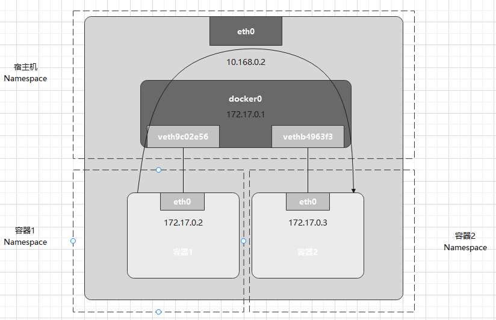

##**知识点**
- 网络栈包括网卡、回环设备、路由表和iptables规则。
- Linux中起到虚拟交换机作用的网络设备是网桥，它是工作在数据链路层的设备，主要功能室根据MAC地址学习将数据包转发到网桥的不同端口。

##**容器的网络**
Docker项目默认会在宿主机上创建一个名为`docker0`的网桥，凡是与docker0网桥连接的容器，都可以通过它来进行通信。

使用`Veth Pair`虚拟设备把容器连接到docker0网桥，Veth Pair设备的特点是，它被创建出来后，总是以两张虚拟网卡（Veth Peer）的形式成对出现，从一张网卡发出的数据包可以直接出现在对应网卡上，哪怕两张网卡在不同的Namespace中。



容器1里有一张eth0网卡，对应另一端在宿主机上，这张网卡veth9c02e56被插在docker0上。一旦一张虚拟网卡被插到网桥上，他就会变成网桥的从设备。从设备会降级为网桥的一个端口，该端口的唯一作用就是接收流入的数据宝，把这些数据包的操作全部交给对应的网桥。

容器1的路由表如下所示：
```
$ route
Destination     Gateway     Genmask     Flags   Metric  Ref Use Iface
default         172.0.0.1   0.0.0.0     UG      0       0   0   eth0
172.17.0.0      0.0.0.0     255.255.0.0 U       0       0   0   eth0
```

在容器1内ping容器2的IP地址（ping 172.17.0.3），目的IP地址会匹配到路由表的第二条，网关为0.0.0.0，意味着这是一条直连路由，经过eth0网卡通过二层网络发往目的主机。

要经过二层网络到达容器2，就要有172.17.0.3这个IP地址对应的MAC地址。所以容器1通过eth0发送一个ARP广播，查找IP地址对应的MAC地址。

docker0网桥收到ARP请求后，会把ARP广播转发到其他插在docker0上的虚拟网卡。容器2收到这个ARP请求，会回复自己的MAC地址给容器1。

拿到容器2的MAC地址后，容器1通过eth0发出数据包，到达虚拟网卡veth9c02e56。由于veth9c02e56网卡的网络协议栈资格被剥夺，数据包会直接流入docker0网桥。

docker0转发时依据目的MAC地址，在它的CAM表中查到对应端口为vethb4963f3,把数据包发往该端口。这样，数据包会通过Veth Pair到达容器2的eth0网卡。

当一个容器试图连接其他宿主机时，发出的请求包首先经过docker0网桥出现在宿主机上，然后根据宿主机路由表的路由规则，经过宿主机的eth0转发到宿主机网络上。
