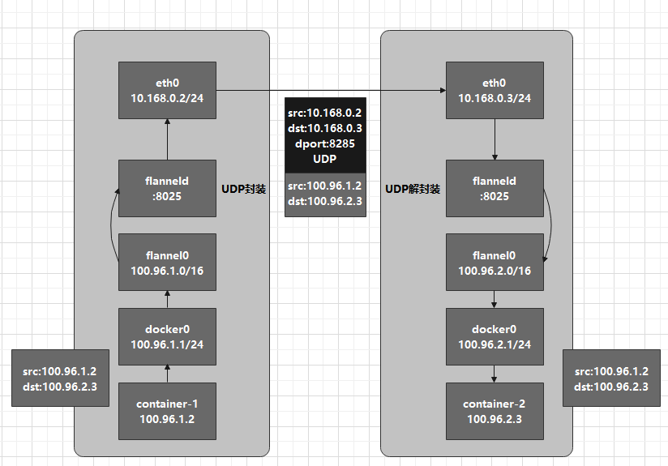
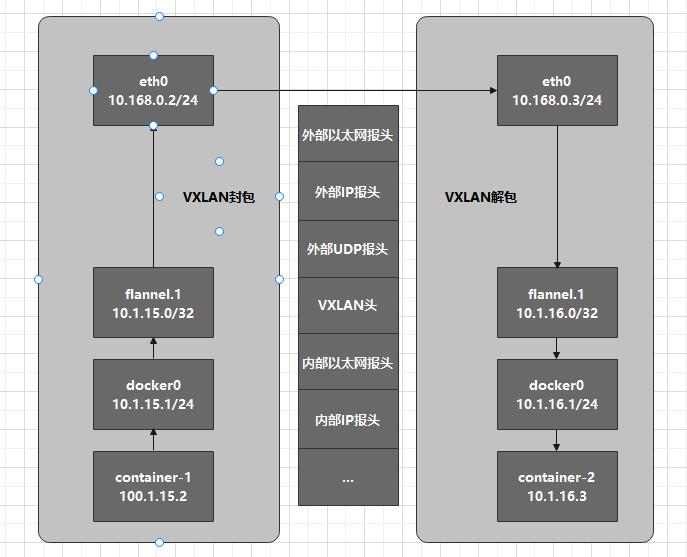

## **知识点**
- pass

## **跨主机通信的本质**

跨主机通信的需求就是与运行在其他宿主机的容器通信。在Docker的默认配置下，一台主机的docker0网桥与其他宿主机上的docker0网桥没有任何关联，他们之间也无法连通。所以，连接在这些网桥上的容器，自然也没办法进行通信了。

但正如单机容器通信中的核心--docker0 和 Veth Pair，多个本机容器中虚拟网卡成对，且固定有一端是连接在docker0上，然后docker0作为网桥为多个本机容器进行报文中转，因此跨主机通信完全可以参照单机通信，通过软件的方式，创建一个整个集群“公用”的网桥，然后把集群里的所有容器都连接到这个网桥上，就可以相互通信了，这就是Overlay Network技术。

## **Flannel网络解决方案**
Flanel支持三种后端实现：
1. UDP
2. VXLAN
3. host-gw

### **UDP**

Flannel UDP 模式的核心思想是两个宿主机各有一个flanneld客户端，然后持续监听8285的udp报文，而这个udp报文就是两个容器通信的载体。flanneld客户端首先对发出端的 IP 包进行 UDP 封装，然后在接收端进行解封装拿到原始的 IP 包，进而把这个 IP 包转发给目标容器。Flannel 在不同宿主机上的两个容器之间打通了一条“隧道”，使得这两个容器可以直接使用 IP 地址进行通信，而无需关心容器和宿主机的分布情况。

实验环境如下：
| 宿主机名 | 宿主机IP | 容器名 | 容器IP | docker0网桥|
|--|--|--|--|--|--|
| Node1 | 10.168.0.2 | container-1 | 100.96.1.2| 100.96.1.1/24|
| Node2 | 10.168.0.3 | container-2 | 100.96.2.3| 100.96.2.1/24|

container-1里的进程发起的IP包，源地址是100.96.1.2，目的地址是100.96.2.3，100.96.2.3不在Node1的docker0网桥的网段里，因此这个IP包交给默认路由规则，通过容器的网关进入docker0网桥，从而出现在宿主机上。

这个IP包的下一个目的地取决于宿主机的路由规则：
```
# 在 Node 1 上
$ ip route
default via 10.168.0.1 dev eth0
100.96.0.0/16 dev flannel0  proto kernel  scope link  src 100.96.1.0
100.96.1.0/24 dev docker0  proto kernel  scope link  src 100.96.1.1
10.168.0.0/24 dev eth0  proto kernel  scope link  src 10.168.0.2
```

由于IP包的目的地址是100.96.2.3，因此匹配到第二条路由规则，进入一个flannel0设备，他是一个**TUN设备**（tunnel设备）。TUN设备是一种在三层工作的虚拟网络设备，它的功能是在操作系统内核和用户应用程序之间传递IP包。

当操作系统将一个IP包发送给flannel0设备后，flannel0就会把这个IP包交给创建该设备的应用程序，也就是Flannel进程。这是从内核态流向了用户态。

反之，如果Flannel进程想flannel0设备发送了一个IP包，这个IP包就会出现在宿主机网络栈中，然后根据宿主机的路由表进一步处理，这是用户态流向了内核态。

现在IP包从容器经过docker0出现在宿主机上，然后通过路由表进入flannel0设备后，宿主机上的flanneld进程就会收到这个IP包。flanneld发现这个IP包的目的地址是100.96.2.3，就把它发送给Node2宿主机。

Flannel项目有一个非常重要的概念：**子网**。在Flannel中，一台宿主机上所有容器都属于该宿主机被分配的一个子网，本例中Node1子网是100.96.1.0/24，Node2子网是100.96.2.0/24，这些子网与宿主机的对应关系保存在etcd中：
```
$ etcdctl ls /coreos.com/network/subnets
/coreos.com/network/subnets/100.96.1.0-24
/coreos.com/network/subnets/100.96.2.0-24
/coreos.com/network/subnets/100.96.3.0-24

$ etcdctl get /coreos.com/network/subnets/100.96.2.0-24
{"PublicIP":"10.168.0.3"}
```

因此flaneld进程收到由flannel0设备传入的IP包时，根据目的地址100.96.2.3匹配子网100.96.2.0/24，然后从etcd中找到这个子网对应的宿主机IP 10.168.0.3。flanneld会把这个IP包封装在一个UDP包中，然后发送到Node2的**8285**端口。

上述流程要正确工作还有一个重要的前提，那就是docker0 网桥的地址范围必须是 Flannel 为宿主机分配的子网。



一次发送流程共涉及三次用户态内核态的切换：第一次，用户态的容器进程发出的IP包经过docker0网桥进入内核态；第二次，IP包根据路由表进入flannel0设备，回到用户态的flanneld进程；第三次，flanneld进行UDP封包后进入内核态，通过eth0将UDP包发送出去。

### **VXLAN**

VXLAN 的覆盖网络的设计思想是：在现有的三层网络之上，“覆盖”一层虚拟的、由内核 VXLAN 模块负责维护的二层网络，使得连接在这个 VXLAN 二层网络上的“主机”（虚拟机或者容器都可以）之间，可以像在同一个局域网（LAN）里那样自由通信。当然，实际上，这些“主机”可能分布在不同的宿主机上，甚至是分布在不同的物理机房里。而为了能够在二层网络上打通“隧道”，VXLAN 会在宿主机上设置一个特殊的网络设备作为“隧道”的两端。这个设备就叫作 **VTEP**，即：VXLAN Tunnel End Point（虚拟隧道端点）。

VTEP 设备的作用，其实跟前面的 flanneld 进程非常相似。只不过，它进行封装和解封装的对象，是二层数据帧；而且这个工作的执行流程，全部是在内核里完成的（因为 VXLAN 本身就是 Linux 内核中的一个模块），这也没有像udp模式下频繁的内核和用户态的数据拷贝，性能高的不是一点半点的。

实验环境如下：
| 宿主机名 | 宿主机IP | 容器名 | 容器IP | docker0网桥|
|--|--|--|--|--|--|
| Node1 | 10.168.0.2 | container-1 | 10.1.15.2| 10.1.15.1/24|
| Node2 | 10.168.0.3 | container-2 | 10.1.16.3| 10.1.16.1/24|

container-1发出的IP数据包，目的地址是10.1.16.3。与前面UDP模式类似，这个IP包会出现在docker0网桥，然后路由到本机的flannel.1设备进行处理，也就是来到了隧道的入口。为了能发送到正确的地址，需要找到隧道的出口，即目的宿主机的VTEP设备。这个信息是由每台宿主机的flanneld进程维护的：

```
# Node 1
$ route -n
Kernel IP routing table
Destination     Gateway         Genmask         Flags Metric Ref    Use  Iface
...
10.1.16.0       10.1.16.0       255.255.255.0   UG     0      0      0   flannel.1
```

这条路由的意思是，凡是发送到10.1.16.0/24网段的数据包，都要经过flannel.1设备发出，并且最后发往的网关地址是10.1.16.0，也就是Node2的VTEP设备的IP地址。

由于通过二层数据帧进行通信，因此知道目的VTEP的IP地址后，还需要知道其MAC地址，这个ARP记录也是由flanneld维护：

```
# Node 1
$ ip neigh show dev flannel.1
10.1.16.0 lladdr 5e:f8:4f:00:e3:37 PERMANENT
```

现在可以Linux内核可以进行二层封包工作了：
|目的VTEP设备的MAC地址|目的容器的IP地址|...|
|--|--|--|

接下来，需要把封装好的内部数据帧进一步封装成一个普通的数据帧，会在内部数据帧前面加上一个VXLAN头，这个VXLAN头里有一个重要标志**VNI**，它是VTEP设备识别数据帧是否归自己处理的标志。

然后，Linux内核会把数据帧封装进一个UDP包发出去，通过flanneld维护的FDB信息：

```
# 在 Node 1 上，使用“目的 VTEP 设备”的 MAC 地址进行查询
$ bridge fdb show flannel.1 | grep 5e:f8:4f:00:e3:37
5e:f8:4f:00:e3:37 dev flannel.1 dst 10.168.0.3 self permanent
```

发往目的VTEP设备（MAC地址 5e:f8:4f:00:e3:37）的二层数据帧，应该通过flannel.1设备发往IP地址为10.168.0.3的主机，也就是Node2。

UDP包是一个四层数据包，所以Linux内核会给它加一个IP头，组成一个IP包，这个IP头里是Node2的IP地址。

然后Linux内核再在这个IP包前面加上二层数据帧头，填入Node2的MAC地址，组成一个完整的数据帧：

|目的主机MAC地址|目的主机IP地址|外部UDP报头|VXLAN头|目的VTEP设备的MAC地址|目的容器的IP地址|...|
|--|--|--|--|--|--|--|

接下来，Node1上的flannel.1设备就可以把这个数据帧通过eth0发送到Node2的eth0。此时Node2的内核网络栈发现这个数据帧有VXLAN头，并且VNI=1,就会交给Node2的flannel.1设备处理。

