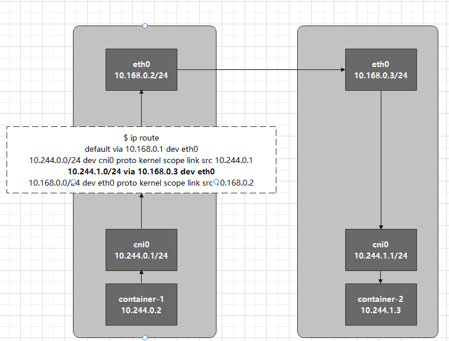
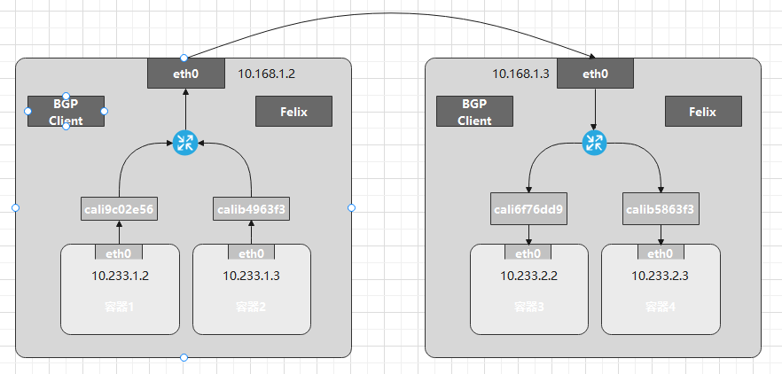
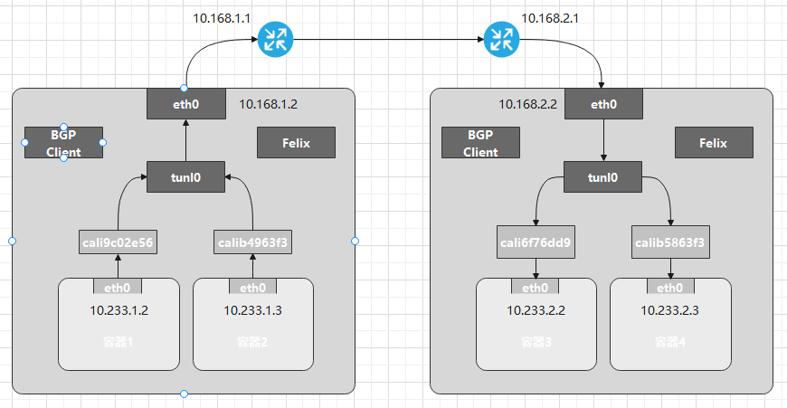
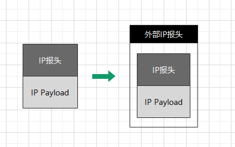

## **知识点**
- pass

## **host-gw**
host-gw模式和之前两种方式不同，它是一种纯三层的网络解决方案，就是完全通过配置路由表和下一跳来实现的。host-gw的原理是将每个Flannel子网的下一跳设置成该子网对应宿主机的IP，这台主机充当这条容器通信路径的网关。



container-1要访问container-2，当设置Flannel为host-gw模式后，flanneld会在宿主机上创建一条路由：

```
# Node 1
$ ip route
10.244.1.0/24 via 10.168.0.3 eth0
```

这条路由规则的含义是，目的地址属于10.244.1.0/24网段的IP包应该从本机eth0发出，并且下一跳的地址是10.168.0.3。

一旦配置了下一跳，接下来当IP包从网络层进入数据链路层被封装成数据帧时，eth0设备就会使用下一跳地址对应的MAC地址，作为该数据帧的目的MAC地址。这样，这个数据帧就会从Node1通过宿主机的二层网络到达Node2。

**以上流程有个前提是，宿主机集群之间是二层相通的**

## **Calico项目**

Calico项目提供的解决方案与Flannel的host-gw模式几乎完全相同，Calico也会在每台宿主机添加一条格式如下的路由规则：
```
<目的容器的IP地址段> via <网关的IP地址> eth0
```

Calico使用**BGP**（边界网关协议）来自动在整个集群中分发路由信息。

Calico项目架构分为三部分：
1. Calico的CNI插件。这是Calico和Kubernetes对接的部分。
2. Felix。它是一个DaemonSet，负责在宿主机插入路由规则，以及维护Calico所需网络设备等。
3. BIRD。它是BGP客户端，专门负责在集群分发路由规则信息。



Calico的CNI插件会为每个容器设置一个Veth Pair设备，其中一端放在宿主机上。但是，Calico没有使用CNI网桥模式，因此CNI插件还需为每个容器的Veth Pair设备在宿主机上配置一条路由：

```
10.233.2.3 dev calib5863f3 scope link
```

意思是发往10.233.2.3的IP包应该进入calib5863f3设备。

**以上流程有个前提是，宿主机集群之间是二层相通的**

## **Calico IPIP**

如果二层不通，则需要打开IPIP模式。



IPIP模式下，Felix进程在Node1添加的路由规则稍有不同：

```
10.233.2.0/24 via 192.168.2.2 tunl0
```

这一次负责将数据包发出去的设备由eth0变成了tunl0。tunl0是一个IP隧道设备，IP包进入后，就会被Linux内核的IPIP驱动接管。将这个IP包直接封装在一个宿主机网络的IP包中：



封装后新的IP包的目的地址就是原IP报的下一跳地址，即Node2的IP地址。这样原先一个从容器到Node2的数据包，就被封装成了一个从Node1到Node2的数据包，这样就可以通过三层转发到达。