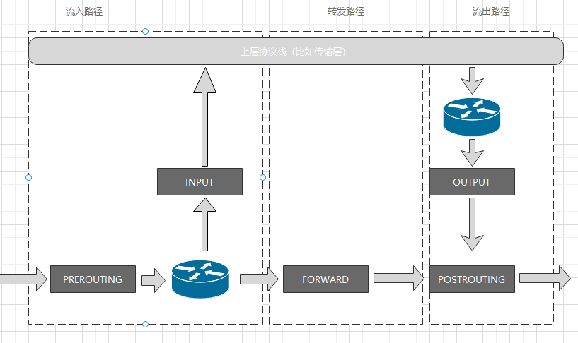

## **知识点**
- pass

## **NetworkPolicy**

Kubernetes中，网络隔离的能力是依靠NetworkPolicy的API对象描述的：
```yaml
apiVersion: networking.k8s.io/v1
kind: NetworkPolicy
metadata:
  name: test-network-policy
  namespace: default
sepc:
  podSelector:
    matchLabels:
      role: db
  policyTypes:
  - Ingress
  - Egress
  ingress:
  - from
    - ipblock:
        cidr: 172.17.0.0/16
        except:
        - 172.17.1.0/24
    - namespaceSelector:
        matchLabels:
          project: myproject
    - podSelector:
        matchLabels:
          role: frontend
    ports:
    - protocol: TCP
      port: 6379
  egress:
  - to:
    - ipblock:
        cidr: 10.0.0.0/24
    ports:
    - protocol: TCP
      port: 5978
```
Kubernetes中的Pod默认都是允许所有访问的，一旦Pod被NetworkPolicy选中，就会进入拒绝所有访问状态。

上面例子中，podSelector字段规定了作用于当前namespace里学带了role=db标签的Pod，如果podSelector字段留空，那么就会作用于当前namespace下所有Pod。

```yaml
spec:
  podSelector: {}
```

NetworkPolicy定义的规则是白名单，这个NetworkPolicy具体的隔离规则如下：
1. 该隔离规则只对default Namespace下携带了role=db的Pod有效，限制的请求类型包括egress和ingress。
2. Kubernetes会拒绝所有对被隔离Pod的访问请求，除非请求来自以下白名单里的对象，并且访问的是被隔离Pod的6379端口，这些白名单对象包括：
   - default Namespace里携带了role=frontend标签的Pod
   - 任何Namespace里携带了project=myproject标签的Pod
   - 任何源地址属于172.17.0.0/16网段，切不属于172.17.1.0/24网段的请求
3. Kubernetes会拒绝被隔离Pod对外发起任何请求，除非请求的目的地址属于10.0.0.0/24网段，并且访问的是改网段地址的5978端口。

NetworkPolicy对象中from和to字段游戏一下要注意的点：
```yaml
...
  ingress:
  - from
    - namespaceSelector:
        matchLabels:
          project: myproject
    - podSelector:
        matchLabels:
          role: frontend
...
```
上面定义的namespaceSelector和podSelector是**或**的关系。

```yaml
...
  ingress:
  - from
    - namespaceSelector:
        matchLabels:
          project: myproject
      podSelector:
        matchLabels:
          role: frontend
...
```
上面定义的namespaceSelector和podSelector是**与**的关系。


## **iptables**

iptables是一个操作Linux内核Netfilter子系统的界面。Netfilter子系统的作用相当于Linux内核挡在网卡和用户进程之间的一到防火墙。



当一个IP包通过网卡进入主机之后，他就进入了Netfilter定义的流入路径中。在这条路径中，IP包要通过路由表路由来决定下一步去向。在这次路由之前，Netfilter设置了一个**PREROUTING**检查点。在Linux内核的实现里，检查点实际上就是内核网络协议栈代码里的Hook。接下来IP包有两种去向：
- 继续在本机处理
- 被转发到其他目的地

如果IP包继续在本地处理，IP包向上层协议栈流动。在它进入传输层之前，Netfilter会设置一个**INPUT**检查点。至此IP包流入路径结束。

接下来IP包通过传输层进入用户空间，处理完成后用户进程会通过本机发出IP包，此时IP包进入流出路径。IP包首先经过主机的路由表进行路由，路由结束后Netfilter会设置一个**OUTPUT**检查点，在OUTPUT之后还会设置一个**POSTROUTING**检查点。

如果IP包不进入传输层，而是在网络层中继续流动，进入转发路径。在转发路径中，Netfilter会设置一个**FORWARD**检查点，之后进入流出路径。

在每一个检查点上，都会按顺序执行几个不同的检查动作（比如raw、nat、filter等）。

## **NetworkPolicy隔离原理**

Kubernetes网络插件对Pod进行隔离，是通过在宿主机生成NetworkPolicy对应的iptables规则实现的。

```yaml
apiVersion: networking.k8s.io/v1
kind: NetworkPolicy
metadata:
  name: test-network-policy
  namespace: default
sepc:
  podSelector:
    matchLabels:
      role: db
  ingress:
  - from
    - namespaceSelector:
        matchLabels:
          project: myproject
    - podSelector:
        matchLabels:
          role: frontend
    ports:
    - protocol: TCP
      port: 6379
```

指定的ingress白名单是任何Namespace携带project=myproject标签的Pod，以及default Namespace携带role=frontend标签的Pod。允许被访问的端口是6379.被隔离的对象是所有携带role=db的Pod。

Kubernetes会在宿主机上生成iptables规则：
```
for dstIP := range 所有被networkpolicy.spec.podSelector选中的Pod的IP地址
    for srcIP := range 所有被ingress.from.podSelector选中的Pod的IP地址
        for port, protocol := range ingress.ports
            iptables -A KUBE-NWPLCY-CHAIN -s $srcIP -d $dstIP -p $protocol -m $protocol --dport $port -j ACCEPT
```

在设置好上述**KUBE-NWPLCY-CHAIN**隔离规则后，网络插件还需要将所有被隔离Pod的访问请求，都转发到KUBE-NWPLCY-CHAIN规则上，如果匹配失败，会拒绝访问。

在网络插件中，设置以下iptables规则：

```
for pod := 该Node上所有Pod
    if pod是NetworkPolicy.spec.podSelector选中的
        iptables -A FORWARD -d $podIP -m --physdev-is-bridged -j KUBE-POD-SPECIFIC-FW-CHAIN
        iptables -A FORWARD -d $podIP -j KUBE-POD-SPECIFIC-FW-CHAIN
```

第一条规则应对的是一种特殊情况：它对应的是同一台宿主机上容器之间经过CNI网桥进行通信流入的数据包，--physdev-is-bridged意思是，这个FORWARD链匹配的是通过本机网桥发往目的地址是podIP的数据包。

第二条规则应对的是普遍情况：容器跨主通信。此时，流入容器的数据包都是经过FORWARD检查点。

这些规则最后都流入了**KUBE-POD-SPECIFIC-FW-CHAIN**, KUBE-POD-SPECIFIC-FW-CHAIN的作用就是做出判断，允许或者拒绝：
```
iptables -A KUBE-POD-SPECIFIC-FW-CHAIN -j KUBE-NWPLCY-CHAIN
iptables -A KUBE-POD-SPECIFIC-FW-CHAIN -j REJECT --reject-with icmp-port-unreachable
```

第一条规则里把IP交给KUBE-NWPLCY-CHAIN规则匹配。如果匹配成功，IP包被允许通过；如果匹配失败，IP包来到第二条规则，被REJECT。