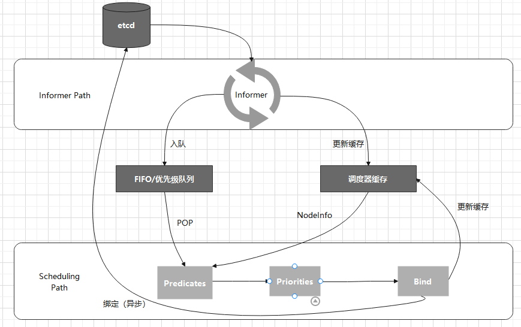

## **知识点**
- pass

## **默认调度器**

默认调度器的主要职责市委新创建出来的Pod寻找一个合适的节点：
1. Predicate。从集群中所有节点中根据调度算法找出所有可以运行该Pod的节点
2. Priority。根据调度算法从第一部的结果中挑选一个最符合的节点

调度器对一个Pod调度成功，就是将它的spec.nodeName字段填上调度结果节点的名称。

Kubernetes调度器的核心，其实就是两个控制循环。

第一个控制循环称为Informer Path。主要目的是启动一系列Informer，监听etcd中Pod、Node、Service等与调度相关的API对象的变化。当一个待调度的Pod被创建出来后，调度器就会通过Pod Informer的Handler将这个待调度Pod添加到一个优先级队列。

默认调度器还负责更新调度器缓存，提高Predicate和Priority调度算法的执行效率。

****

第二个控制循环是调度器负责调度Pod的主循环，称为Scheduling Path。主要罗就是不断从队列中出队一个Pod，依次调用Predicate和Priority算法选出最合适节点，在Bind操作中，将它的spec.nodeName字段填上调度结果节点的名称。

Kubernetes默认调度器在Bind阶段只会更新调度器缓存里的信息，这种基于乐观假设的API对象更新方式，称为**Assume**。Assume完成后，调度器才会创建一个Goroutine来异步向API Server发起更新Pod请求，完成真正的Bind操作。

基于乐观绑定的设计，当一个Pod完成调度需要在某个节点运行起来之前，该节点上的kubelet还会通过一个**Admit**的操作来验证该Pod是否能在该节点运行。
Admit实际上就是运行一组叫作GeneralPridicates的最基本的调度算法。

除了**缓存化**和**乐观绑定**，默认调度器还有另外一个重要设计：**无锁化**。

调度器会启动多个Goroutine以节点为粒度并发执行Predicates算法，Priorities算法也会以MapReduce方式进行计算汇总。而在所有需要并发的路径上，调度器会避免设置任何全局的竞争资源，免除使用锁进行同步产生的性能损耗。

所以，调度器只有在对调度队列和调度器缓存进行操作时才需要加锁。